# Android-Apps
Android Apps for educational purposes.

## Memorable Places
  

## Notes App
  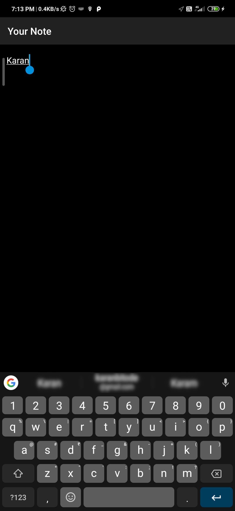

## Tic Tac Toe
 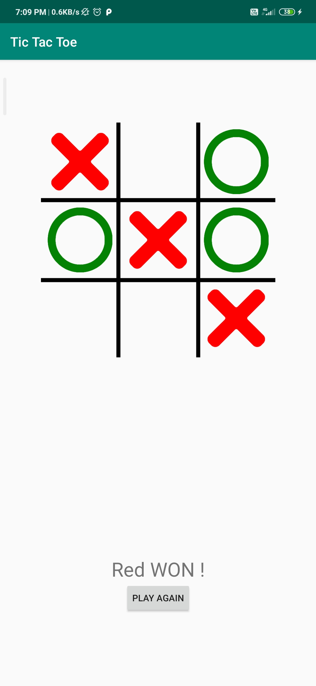

## Instagram Clone
 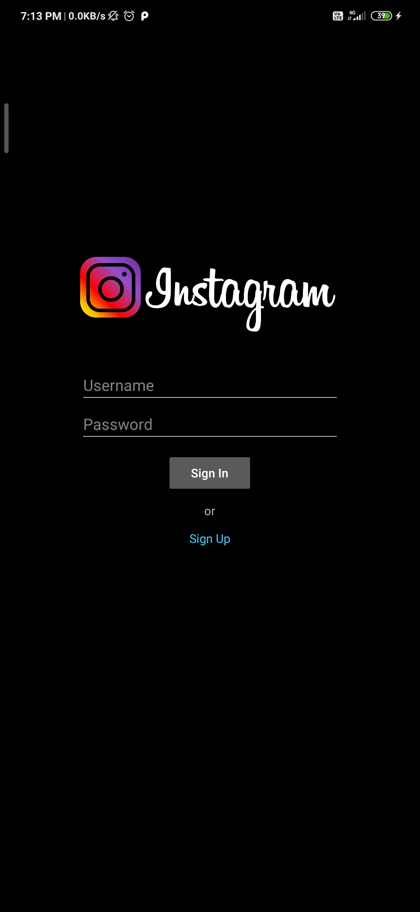  

## Twitter Clone
 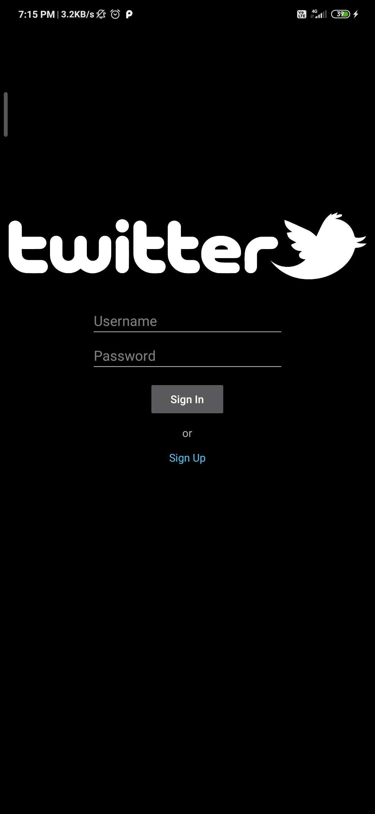  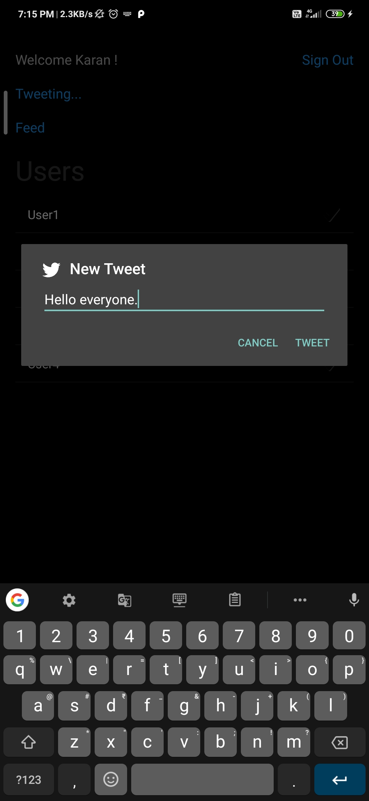 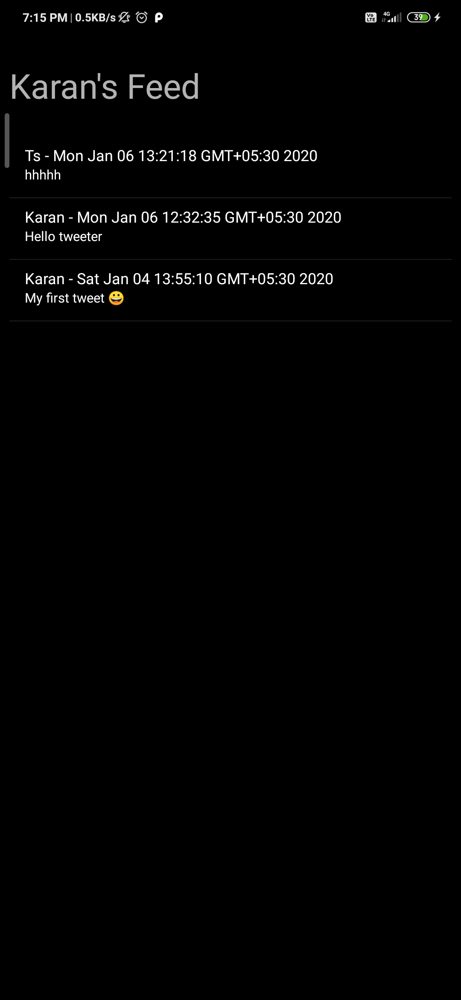

## Whatsapp Clone
 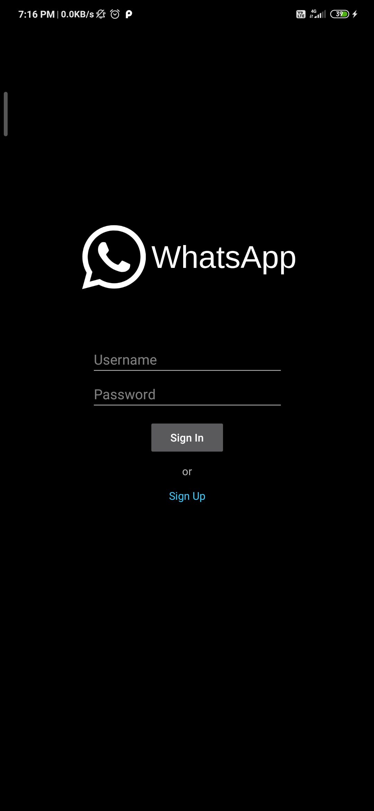  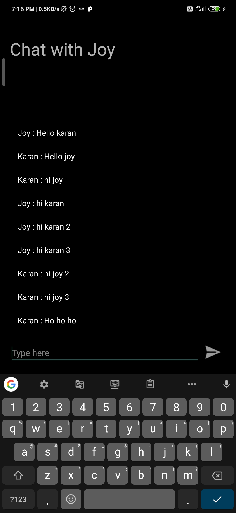

## Guess Indian Scientists
 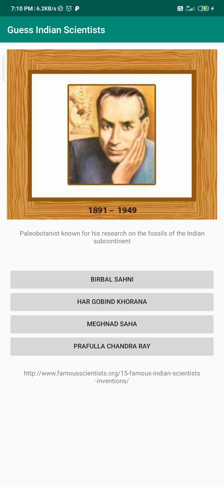

## Flappy Bird
 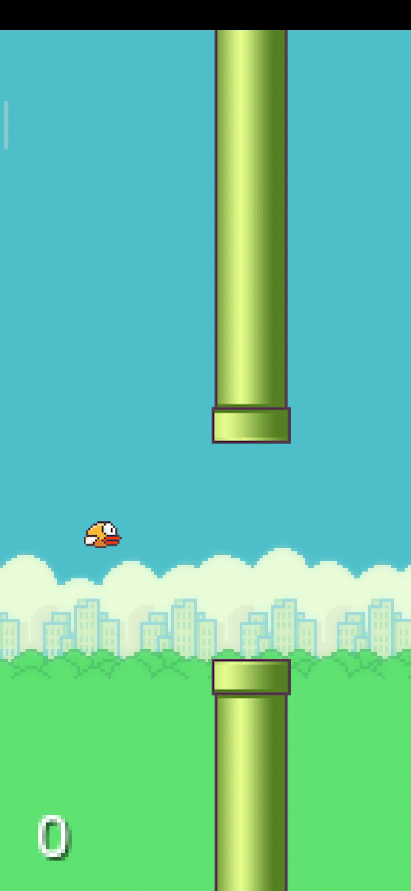 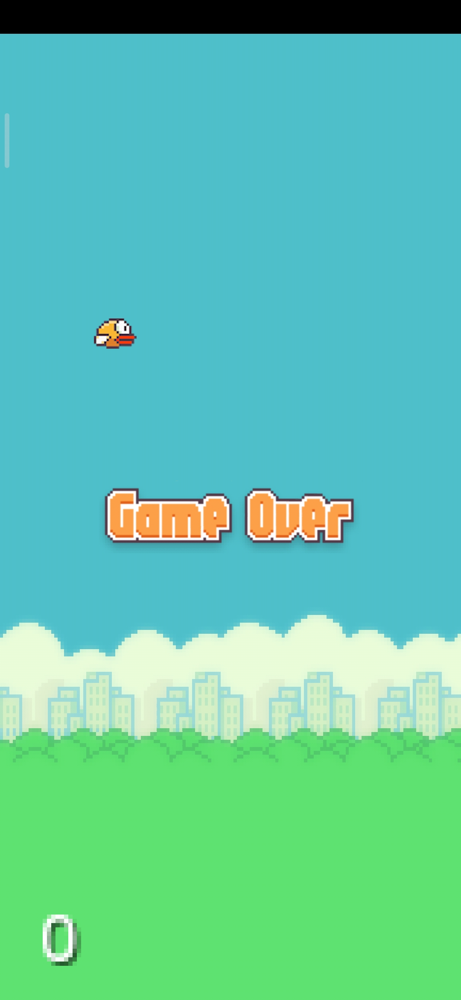

## Hiker's Watch
 

## Brain Trainer
 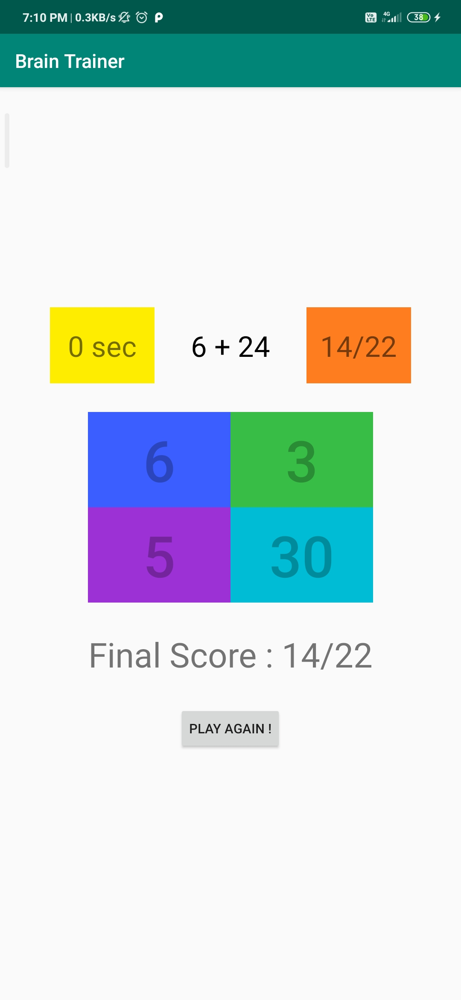

## Music Player
 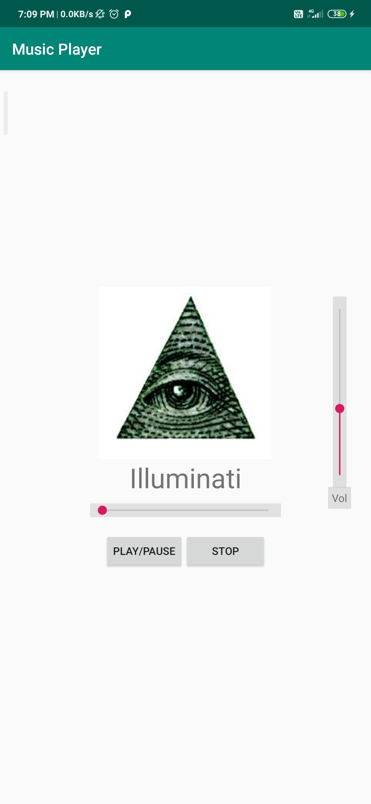
