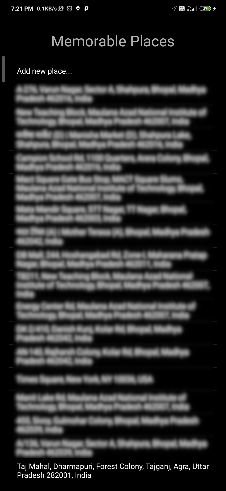
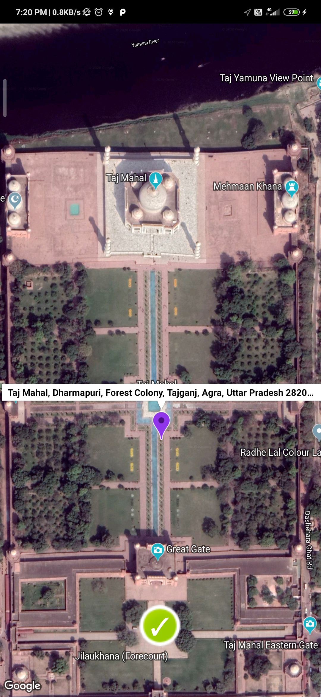

# Android-Apps
Android Apps for educational purposes.

1. **Memorable Places**
  

2. **Notes App**
3. Tic Tac Toe
4. Instagram Clone
5. Twitter Clone
6. Whatsapp Clone
7. Guess Indian Scientists
8. Flappy Bird
9. Hiker's Watch
10. Brain Trainer
11. Music Player
